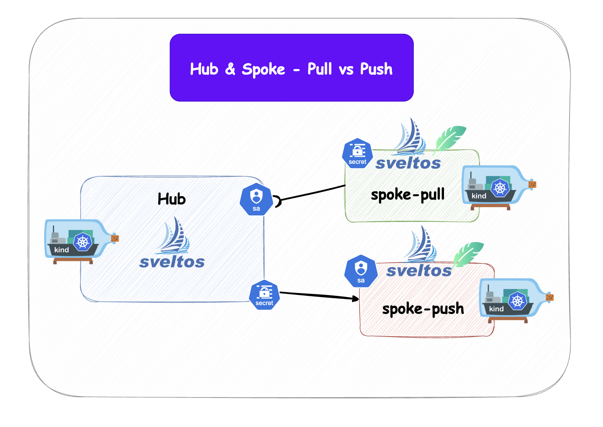

# PlatformCon 2026 - Workshop - When hub-and-spoke GitOps becomes a security risk at scale - Quickstart!

Welcome to the PlatformCon 2026 workshop on "When hub-and-spoke GitOps becomes a security risk at scale".
In this workshop, we will explore the potential security risks associated with hub-and-spoke GitOps architectures and discuss strategies to mitigate these risks effectively.

After the workshop you should have a better understanding of:

- What is hub-and-spoke GitOps and how it works
- Why it can become a security risk at scale
- Why it matters for platform teams by thinking on retail, franchise, production - everything that runs on a edge location as spoke or stand-alone cluster
- You will also understand what real scale by getting a sneak peak into our scale test to predict the management of 15.000+ clusters based on [kubara.io](https://kubara.io)
- Best practices for securing hub-and-spoke GitOps environments
- How agent based Pull Mode allows to mitigate some of the risks

*Important:* The focus of the webinar would be on the security risks of hub-and-spoke GitOps architectures, and the strategies to mitigate these risks effectively.

You should have a basic understanding of:

- GitOps with Argo CD or Flux CD or Sveltos Addoncontroller
- Kubernetes

## Setup Environment

This is the quickstart version of the demo environment. If you want understand what happens behind the scenes, then check out the [long version](DEEP-DIVE.md) of the setup instructions.

### Prerequisites

- [kubectl](https://kubernetes.io/docs/tasks/tools/) v1.35.0 or later
- [sveltosctl](https://projectsveltos.github.io/sveltos/getting_started/sveltosctl/sveltosctl/) v1.9.0 or later
- [Kubernetes in Docker (KinD)](https://kind.sigs.k8s.io/docs/user/quick-start/#installation) v0.31.0 or later
- [helm](https://helm.sh/docs/intro/install/) v4.1.0 or later
- [Docker](https://docs.docker.com/desktop/), [OrbStack](https://orbstack.dev/download) or another KinD-supported container runtime

Overview of the demo environment:



### KinD demo clusters

Create the clusters:

```bash
make kind-up-quickstart
```

The setup writes reusable kubeconfigs into `tmp/platformcon-sveltos/`.

After creation, the kubectl contexts are:

- `kind-hub`
- `kind-spoke-push`
- `kind-spoke-pull`

Check Sveltos resources in the hub:

```bash
kubectl --context kind-hub get clusterprofiles
kubectl --context kind-hub get sveltoscluster -A --show-labels
```

Verify the deployment in the managed cluster:

```bash
kubectl --context kind-hub get clustersummaries.config.projectsveltos.io -A -o wide

#or

KUBECONFIG=tmp/platformcon-sveltos/hub.kubeconfig sveltosctl show addons
```

Done! ✅

---

### Explore the environment

You can switch the environments with:

```bash
kubectl config use-context kind-hub
kubectl config use-context kind-spoke-push
kubectl config use-context kind-spoke-pull
```
Let's first take a look on the two registered clusters in the hub:

```bash
kubectl --context kind-hub get sveltoscluster -A --show-labels
```

Let's check if the applications are deployed in the managed clusters:

```bash
kubectl --context kind-hub get clustersummaries.config.projectsveltos.io -A -o wide
```

In the next part get an understanding of the differences between push and pull mode.


#### Push Mode

See if you can see the helm installed in the spoke-push cluster:

```bash
helm --kube-context kind-spoke-push list -A
```

See if you can see the kubeconfig secret in the spoke-push cluster:

```bash
kubectl --context kind-spoke-push get secret -n projectsveltos
```

See if you can see the kubeconfig secret in the hub:

```bash
kubectl --context kind-hub get secret -n spoke-push
```


#### Pull Mode


See if you can see the helm installed in the spoke-pull cluster:

```bash
helm --kube-context kind-spoke-pull list -A
```

See if you can see the kubeconfig secret in the spoke-pull cluster:

```bash
kubectl --context kind-spoke-pull get secret -n projectsveltos
```

See if you can see the kubeconfig secret in the hub:

```bash
kubectl --context kind-hub get secret -n spoke-pull
```


Can you spot the difference?

#### Understand Sveltos ClusterProfiles

Sveltos works with ClusterProfiles, which allows you to define multiple application that can be deployed, progressive delivery strategy, patching and much more.
We will only focus on the match label part.

In easy terms. You put an label on managed cluster by Sveltos and Sveltos will deploy the application based on the match in the ClusterProfile.


See which ClusterProfiles are deployed in the hub:

```bash
kubectl --context kind-hub get clusterprofiles
```

See the defintion of the ClusterProfile:

```bash
kubectl --context kind-hub describe ClusterProfile kro
```

If you want deploy another application based on the existing ClusterProfiles, then you can just a another label to the cluster and Sveltos will do the rest.

```bash
kubectl --context kind-hub label sveltoscluster kind-spoke-pull \
  -n spoke-pull \
  cert-manager=enabled \
  --overwrite
```

Check if Sveltos deployed the application:

```bash
kubectl --context kind-hub get clustersummaries.config.projectsveltos.io -A -o wide
```

You can also use the sveltosctl to check the addons:

```bash
kubectl config use-context kind-hub

sveltosctl show addons

┌────────────────────────────┬───────────────┬──────────────┬──────────────┬─────────┬────────────────────────────────┬─────────────────┬─────────────────────────────┐
│          CLUSTER           │ RESOURCE TYPE │  NAMESPACE   │     NAME     │ VERSION │              TIME              │ DEPLOYMENT TYPE │          PROFILES           │
├────────────────────────────┼───────────────┼──────────────┼──────────────┼─────────┼────────────────────────────────┼─────────────────┼─────────────────────────────┤
│ spoke-pull/kind-spoke-pull │ helm chart    │ kro-system   │ kro          │ v0.9.1  │ 2026-06-20 14:03:25 +0200 CEST │ Managed cluster │ ClusterProfile/kro          │
│ spoke-pull/kind-spoke-pull │ helm chart    │ cert-manager │ cert-manager │ v1.20.2 │ 2026-06-20 14:20:38 +0200 CEST │ Managed cluster │ ClusterProfile/cert-manager │
│ spoke-push/kind-spoke-push │ helm chart    │ kro-system   │ kro          │ v0.9.1  │ 2026-06-20 14:03:14 +0200 CEST │ Managed cluster │ ClusterProfile/kro          │
└────────────────────────────┴───────────────┴──────────────┴──────────────┴─────────┴────────────────────────────────┴─────────────────┴─────────────────────────────┘
```


### Clean up

```bash
make kind-down
```